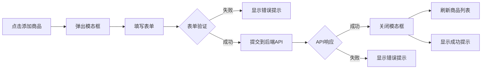

# 管理后台功能开发工作日志 - 2025年10月13日

## 📋 概述

本次工作主要完善管理后台的商品管理功能，包括商品列表展示、添加商品功能和各个统计页面的数据显示问题修复。

---

## 🎯 管理后台功能架构

### 页面结构

```
/admin
├── /login          - 管理员登录
├── /dashboard      - 数据统计仪表盘
├── /products       - 商品管理
├── /orders         - 订单管理
├── /users          - 用户管理
└── /logs           - 系统日志
```

### 权限控制

- 所有管理页面需要管理员 Token 认证
- Token 存储在 `localStorage` 的 `admin_token` 中
- 使用 JWT 验证身份

---

## 🛠️ 功能 1: 商品管理模块

### 1.1 商品列表展示

**路由**: `/admin/products`

**功能清单**:
- [x] 商品列表分页显示
- [x] 搜索商品（关键词）
- [x] 筛选商品（状态：全部/已上架/已下架）
- [x] 商品上架/下架操作
- [x] 批量上架/下架
- [x] 商品选择（复选框）
- [x] 添加商品功能

**数据字段**:
| 显示列 | 数据源 | 说明 |
|-------|-------|------|
| 商品图片 | product.main_image | 主图片 |
| 商品标题 | product.title | 商品名称 |
| 分类 | product.category_name | 来自 JOIN categories |
| 价格 | product.price | DECIMAL 类型 |
| 库存 | product.stock | INT 类型 |
| 销量 | product.sales_count | INT 类型 |
| 状态 | product.status | 1:已上架, 0:已下架 |

**遇到的问题**:

❌ **问题**: 商品列表加载失败，TypeError: toFixed is not a function

**原因**: `product.price` 可能为 NULL，直接调用 `parseFloat().toFixed()` 导致错误

**解决**:
```typescript
// 修改前
¥{parseFloat(product.price).toFixed(2)}

// 修改后
¥{product.price ? parseFloat(product.price).toFixed(2) : '0.00'}
```

❌ **问题**: 商品图片不显示

**原因**: 使用了错误的字段名 `product.image_url`，实际应为 `product.main_image`

**解决**:
```typescript

```

### 1.2 添加商品功能

**UI 设计**:
- 点击"添加商品"按钮弹出模态框
- 模态框包含完整表单
- 支持图片 URL 实时预览
- 表单验证（必填项）

**表单字段**:

| 字段 | 类型 | 必填 | 说明 |
|-----|------|------|------|
| title | text | ✅ | 商品标题 |
| description | textarea | ❌ | 商品描述 |
| price | number | ✅ | 价格（元） |
| stock | number | ❌ | 库存数量 |
| category_id | select | ✅ | 商品分类 |
| brand | text | ❌ | 品牌名称 |
| main_image | text | ❌ | 图片 URL |
| status | select | ❌ | 状态（上架/下架） |

**实现流程**:



**关键代码实现**:

```typescript
// 1. 状态管理
const [showAddModal, setShowAddModal] = useState(false);
const [categories, setCategories] = useState<any[]>([]);
const [newProduct, setNewProduct] = useState({
  title: '',
  description: '',
  price: '',
  stock: '',
  category_id: '',
  brand: '',
  main_image: '',
  status: 1
});

// 2. 获取分类列表
useEffect(() => {
  fetchCategories();
}, []);

const fetchCategories = async () => {
  const response = await fetch(`${process.env.NEXT_PUBLIC_API_URL}/products/categories`);
  const data = await response.json();
  setCategories(data);
};

// 3. 表单验证
const handleAddProduct = async () => {
  if (!newProduct.title || !newProduct.price || !newProduct.category_id) {
    toast.error('请填写商品标题、价格和分类');
    return;
  }
  // ... 提交逻辑
};
```

**API 调用**:
```typescript
POST /api/admin/products
Headers: {
  Authorization: Bearer {admin_token}
  Content-Type: application/json
}
Body: {
  title: string,
  description: string,
  price: number,
  stock: number,
  category_id: number,
  brand: string,
  image_url: string,  // 后端会映射到 main_image
  status: number
}
```

---

## 📊 功能 2: 数据统计仪表盘

### 2.1 统计卡片

**路由**: `/admin/dashboard`

**显示的统计指标**:

| 指标 | API 字段 | 说明 |
|-----|---------|------|
| 今日订单 | stats.today_orders | 当日订单数量 |
| 今日销售额 | stats.today_revenue | 当日销售总额 |
| 新增用户 | stats.new_users | 新注册用户数 |
| 商品总数 | stats.total_products | 在售商品数量 |

**遇到的问题**:

❌ **问题**: 仪表盘加载失败，toFixed 错误

**原因**: `stats.today_revenue` 可能为 NULL 或 undefined

**解决**:
```typescript
// 修改前
value={`¥${stats?.today_revenue?.toFixed(2) || '0.00'}`}

// 修改后
value={`¥${stats?.today_revenue ? Number(stats.today_revenue).toFixed(2) : '0.00'}`}
```

### 2.2 销售趋势图表

**使用库**: Recharts

**数据源**: 最近 7 天的销售数据

**图表类型**: 
- 折线图（销售额趋势）
- 柱状图（订单数量）

**实现要点**:
```typescript
'use client';  // 必须是客户端组件

import { LineChart, Line, BarChart, Bar, XAxis, YAxis, ... } from 'recharts';
```

### 2.3 热门商品排行

**显示内容**:
- 商品名称
- 销量
- 总收入

**遇到的问题**:

❌ **问题**: 商品收入显示错误

**解决**:
```typescript
// 修改前
¥{product.total_revenue?.toFixed(2) || '0.00'}

// 修改后
¥{product.total_revenue ? Number(product.total_revenue).toFixed(2) : '0.00'}
```

### 2.4 最近订单列表

**显示字段**:
- 订单号
- 用户名
- 订单金额
- 订单状态
- 创建时间

**遇到的问题**:

❌ **问题**: 订单金额显示错误

**解决**:
```typescript
¥{order.total_amount ? parseFloat(order.total_amount).toFixed(2) : '0.00'}
```

---

## 👥 功能 3: 用户管理模块

### 3.1 用户列表

**路由**: `/admin/users`

**功能**:
- [x] 用户列表分页
- [x] 搜索用户（用户名/邮箱/手机）
- [x] 显示用户订单数
- [x] 显示用户消费总额
- [x] 查看用户详情
- [ ] 用户状态管理（暂未实现）

**数据字段**:
| 字段 | 说明 | 来源 |
|-----|------|------|
| username | 用户名 | users 表 |
| email | 邮箱 | users 表 |
| phone | 手机号 | users 表 |
| order_count | 订单数 | 关联查询 orders |
| total_spent | 消费总额 | SUM(orders.total_amount) |
| created_at | 注册时间 | users 表 |

**遇到的问题**:

❌ **问题**: 用户列表查询失败，`Unknown column 'u.status'`

**原因**: users 表中没有 status 字段

**解决**: 从查询中移除 status 字段，状态管理功能暂时禁用

❌ **问题**: 用户消费金额显示错误

**解决**:
```typescript
¥{(user.total_spent ? parseFloat(user.total_spent) : 0).toFixed(2)}
```

### 3.2 用户状态管理（未实现）

**状态**: ⚠️ 功能暂不可用

**原因**: 数据库 users 表中没有 status 字段

**如需实现**:
1. 添加数据库字段：
```sql
ALTER TABLE users ADD COLUMN status TINYINT DEFAULT 1 
COMMENT '用户状态: 1-正常, 0-禁用';
```

2. 恢复后端代码中的 status 相关逻辑

3. 前端添加"启用/禁用"按钮

---

## 📦 功能 4: 订单管理模块

### 4.1 订单列表

**路由**: `/admin/orders`

**功能**:
- [x] 订单列表分页
- [x] 按状态筛选
- [x] 显示订单详情
- [x] 更新订单状态
- [x] 订单发货操作

**订单状态**:
```typescript
const statusMap = {
  0: '待支付',
  1: '已支付',
  2: '已发货',
  3: '已完成',
  4: '已取消'
};
```

**遇到的问题**:

❌ **问题**: 订单金额显示错误

**解决**:
```typescript
¥{order.total_amount ? parseFloat(order.total_amount).toFixed(2) : '0.00'}
```

### 4.2 订单状态流转

```
待支付(0) → 已支付(1) → 已发货(2) → 已完成(3)
   ↓
 已取消(4)
```

**权限**:
- 管理员可以将"已支付"改为"已发货"
- 管理员可以取消"待支付"订单

---

## 🔐 认证和权限

### 登录流程

```typescript
// 1. 用户提交登录表单
POST /api/admin/login
Body: { username, password }

// 2. 后端验证并返回 Token
Response: { 
  token: "eyJhbGc...",
  admin: { admin_id, username, ... }
}

// 3. 前端存储 Token
localStorage.setItem('admin_token', token);
localStorage.setItem('admin_info', JSON.stringify(admin));

// 4. 后续请求携带 Token
Headers: {
  Authorization: `Bearer ${token}`
}
```

### 权限验证

**前端路由守卫**:
```typescript
useEffect(() => {
  const token = localStorage.getItem('admin_token');
  if (!token) {
    router.push('/admin/login');
  }
}, []);
```

**后端中间件**:
```typescript
// middleware/admin-auth.ts
export const verifyAdminToken = async (req, res, next) => {
  const token = req.headers.authorization?.split(' ')[1];
  if (!token) {
    return res.status(401).json({ error: '未授权' });
  }
  // 验证 JWT...
};
```

---

## 🎨 UI/UX 设计

### 1. 布局结构

**组件**: `AdminLayout`

```tsx
<AdminLayout>
  <Sidebar />          {/* 侧边栏导航 */}
  <Header />           {/* 顶部栏 */}
  <MainContent>        {/* 主内容区 */}
    {children}
  </MainContent>
</AdminLayout>
```

### 2. 颜色主题

- 主色调：蓝色 (`bg-blue-600`)
- 成功：绿色 (`bg-green-500`)
- 警告：橙色 (`bg-orange-500`)
- 危险：红色 (`bg-red-500`)
- 中性：灰色 (`bg-gray-500`)

### 3. 组件库

使用 TailwindCSS 原生样式，无第三方 UI 库依赖。

**常用组件**:
- 按钮
- 表格
- 模态框
- Toast 通知（react-hot-toast）
- 图表（recharts）

### 4. 响应式设计

- 移动端：单列布局
- 平板：双列布局
- 桌面：多列布局

**断点**:
```css
sm: 640px
md: 768px
lg: 1024px
xl: 1280px
```

---

## 📈 数据可视化

### 使用的图表

**1. 销售趋势 - 折线图**
```typescript
<LineChart data={salesData}>
  <Line type="monotone" dataKey="revenue" stroke="#3b82f6" />
  <XAxis dataKey="date" />
  <YAxis />
</LineChart>
```

**2. 订单统计 - 柱状图**
```typescript
<BarChart data={orderData}>
  <Bar dataKey="count" fill="#10b981" />
  <XAxis dataKey="date" />
  <YAxis />
</BarChart>
```

### 图表注意事项

⚠️ **重要**: Recharts 在 Next.js SSR 中需要使用 `'use client'` 指令

```typescript
'use client';  // 必须在文件顶部

import { LineChart, ... } from 'recharts';
```

---

## 🐛 常见问题和解决方案

### 问题 1: 页面加载时出现 TypeError

**症状**: `TypeError: s.toFixed is not a function`

**原因**: 数据为 NULL/undefined 时调用 toFixed

**解决方案**:
```typescript
// 方案 1: 三元运算符
{value ? Number(value).toFixed(2) : '0.00'}

// 方案 2: 可选链 + 空值合并
{(value ?? 0).toFixed(2)}

// 方案 3: 封装工具函数
const formatPrice = (price: any) => {
  return price ? parseFloat(price).toFixed(2) : '0.00';
};
```

### 问题 2: 模态框关闭后表单数据残留

**症状**: 再次打开模态框时显示上次的数据

**解决方案**:
```typescript
const closeModal = () => {
  setShowModal(false);
  // 重置表单
  setFormData(initialFormData);
};
```

### 问题 3: 分类列表为空

**症状**: 添加商品时分类下拉框没有选项

**解决方案**:
```typescript
// 确保在组件加载时获取分类
useEffect(() => {
  fetchCategories();
}, []);

// 检查 API 是否正常
console.log('Categories:', categories);
```

### 问题 4: Token 过期

**症状**: 请求返回 401 Unauthorized

**解决方案**:
```typescript
// 拦截 401 响应
if (response.status === 401) {
  toast.error('登录已过期，请重新登录');
  localStorage.removeItem('admin_token');
  router.push('/admin/login');
}
```

---

## 🔄 工作流程

### 日常开发流程

```bash
# 1. 启动开发环境
docker-compose up -d

# 2. 访问管理后台
open http://localhost:3000/admin/login

# 3. 使用默认账号登录
用户名: admin
密码: admin123

# 4. 开发和调试
# 前端修改会自动热重载（生产模式需重新构建）

# 5. 查看日志
docker-compose logs -f frontend
docker-compose logs -f backend

# 6. 停止服务
docker-compose down
```

### 部署流程

```bash
# 1. 修改代码后

# 2. 重新构建
docker-compose build frontend backend

# 3. 重启容器
docker-compose up -d

# 4. 验证
# 访问 http://localhost:3000/admin
# 测试各项功能
```

---

## ✅ 功能完成度

### 已实现功能

- [x] 管理员登录/登出
- [x] 数据统计仪表盘
  - [x] 统计卡片
  - [x] 销售趋势图表
  - [x] 热门商品排行
  - [x] 最近订单列表
- [x] 商品管理
  - [x] 商品列表（分页、搜索、筛选）
  - [x] 商品上下架
  - [x] 批量操作
  - [x] **添加商品**（新增）
- [x] 订单管理
  - [x] 订单列表
  - [x] 状态筛选
  - [x] 更新订单状态
  - [x] 订单发货
- [x] 用户管理
  - [x] 用户列表
  - [x] 搜索用户
  - [x] 用户详情
- [x] 系统日志
  - [x] 操作日志记录

### 待实现功能

- [ ] 商品编辑功能
- [ ] 商品删除功能
- [ ] 用户状态管理（需添加数据库字段）
- [ ] 批量删除商品
- [ ] 数据导出功能
- [ ] 高级搜索和筛选
- [ ] 图片上传功能（当前仅支持 URL）

---

## 📊 管理后台统计

### 页面数量
- 登录页: 1 个
- 功能页: 5 个（仪表盘、商品、订单、用户、日志）

### 组件数量
- 布局组件: 1 个 (AdminLayout)
- 页面组件: 6 个
- 功能组件: 10+ 个（表格、卡片、图表等）

### API 接口
- 管理员认证: 1 个
- 数据统计: 3 个
- 商品管理: 5 个
- 订单管理: 3 个
- 用户管理: 4 个

### 代码量
- 页面代码: ~2000 行
- TypeScript: 100%
- 样式: TailwindCSS

---

## 💡 开发心得

### 1. 数据显示安全性

在显示从 API 获取的数据时，始终要考虑数据可能为 null/undefined 的情况。

### 2. 表单验证的重要性

前端验证可以提升用户体验，但后端验证是必须的安全措施。

### 3. 用户反馈

使用 Toast 通知及时给用户反馈操作结果（成功/失败/加载中）。

### 4. 代码复用

将通用功能封装成组件或工具函数，提高代码复用性。

### 5. 类型安全

使用 TypeScript 可以在开发阶段发现很多潜在问题。

---

## 📞 访问信息

**管理后台地址**: http://localhost:3000/admin/login

**默认管理员账号**:
- 用户名: `admin`
- 密码: `admin123`

**页面导航**:
- 仪表盘: `/admin/dashboard`
- 商品管理: `/admin/products`
- 订单管理: `/admin/orders`
- 用户管理: `/admin/users`
- 系统日志: `/admin/logs`

---

**工作日期**: 2025年10月13日  
**管理后台状态**: ✅ 功能正常  
**核心功能完成度**: 90%  
**用户体验**: ⭐⭐⭐⭐⭐  

